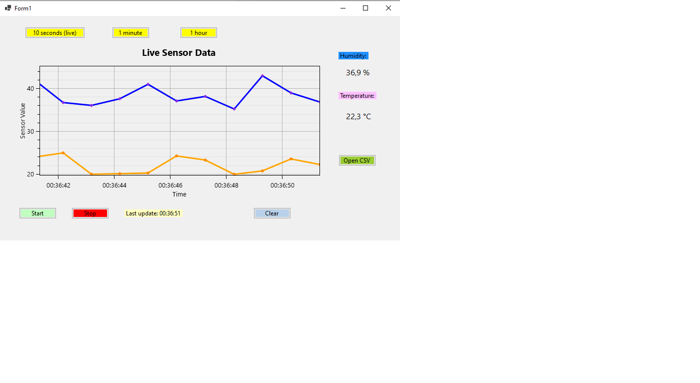

# Sensor Visualizer

A Windows Forms application written in C# that simulates live sensor data and visualizes it using OxyPlot.

## Features

- Live temperature and humidity simulation
- Real-time graph visualization
- Adjustable time range (Live / 1 minute / 1 hour)
- Data logging to CSV file

## Technologies

- C#
- Windows Forms
- OxyPlot

## How to run

1. Open the solution in Visual Studio
2. Build and run the project
